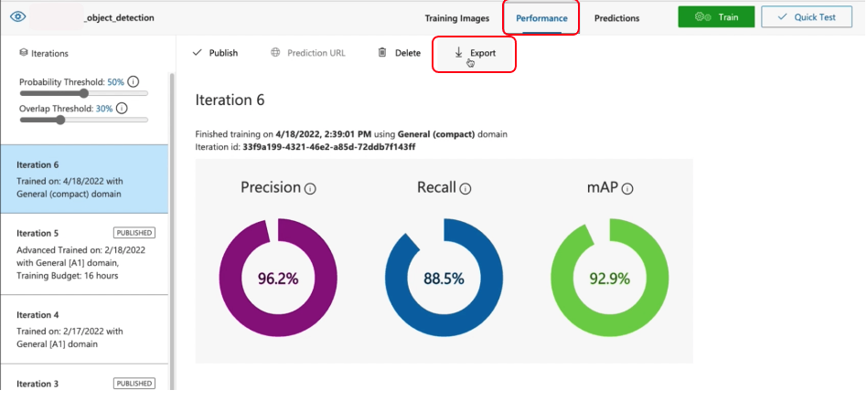

# cv-model-with-deepstream-on-AKS4HCI

The goal of this readme is to guide you to containerize your own model generated by Custom Vision website as an edge ai module and run on AKS on HCI VM. 

## Prerequesite
1. The video is going to be inferenced
2. HCI VM with AKS installed

## Architecture

## Content
| File             | Description                                                   |
|-------------------------|---------------------------------------------------------------|
| `readme`    | This readme file |
| `MyCustomThings/config_infer_custom_vision.txt`    | The config file for edge ai module for HCI |
| `MyCustomThings/libnvdsinfer_custom_impl_Yolo_dp61_amd.so`    | The parser library of the custom vision model for HCI VM |
| `MyCustomThings/labels.txt`    | The labels file of the model|
| `MyCustomThings/model.onnx`    | The onnx model export from custom vision website  |
| `MyCustomThings/input.MP4`    | The video is going to be inferenced |

## Steps
### Step 1 - Export your model from custom vision website
1. Create an object detection model as in [here](https://docs.microsoft.com/en-us/azure/cognitive-services/custom-vision-service/get-started-build-detector)

2. Export your model with ONNX platform
   1. Switch to the `Performance` tab
   2. Select the `Export` button that appears
      
   3. Select `ONNX`, and then `Export`
      
   4. Once the file is ready, select the `Download` button. 
   5. Open the downloaded .zip file and extract the `model.onnx`, `label.txt` file from it. This file contains your object detection model.
   
      

### Step 2.1 - Set RTSP stream as your output to view the inference result

### Step 2.2 - Output as a video file to get the inference result

### Step 3 - Containerize as a edge ai module and push to ACR or docker hub

